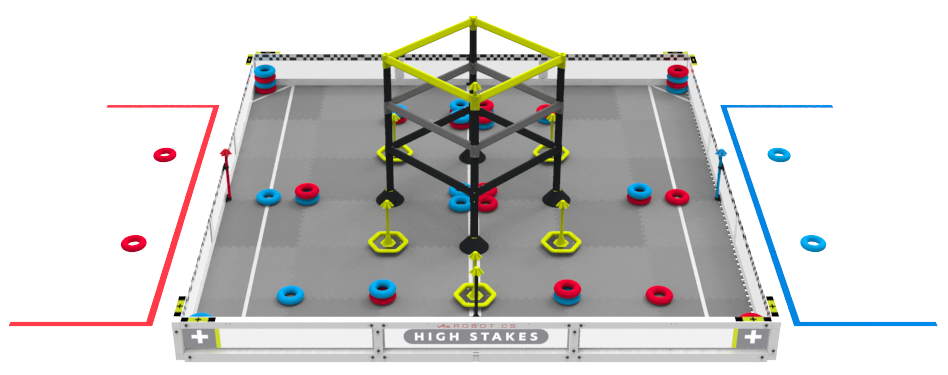
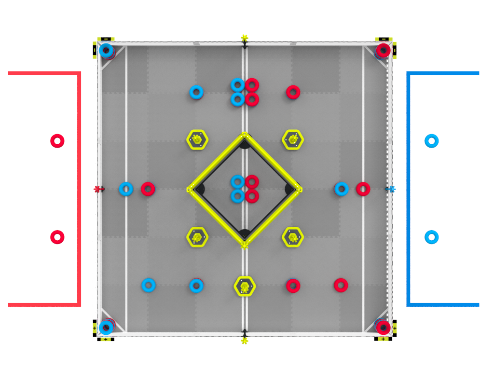
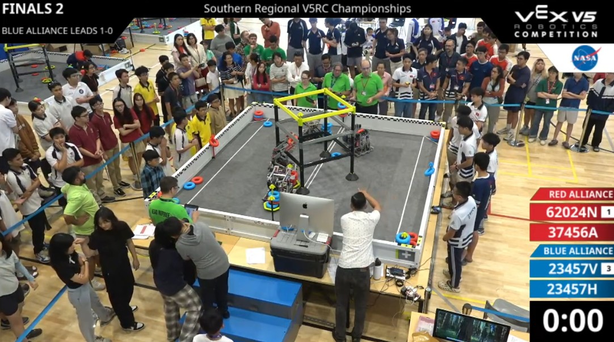
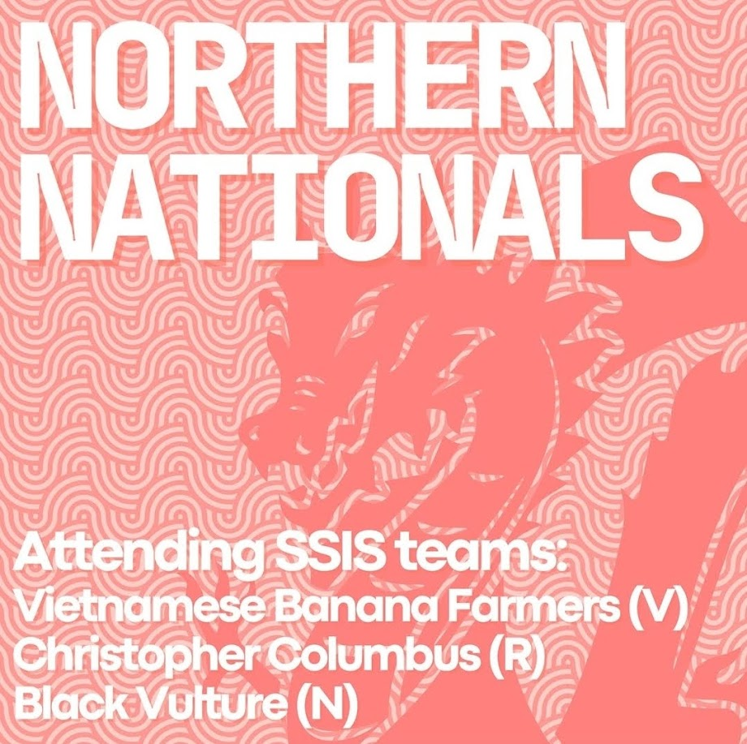

# 2025 High Stakes

SSIS Robotics in the "High Stakes" VEX competition 2024-2025

## SSIS VEX Robotics Scrimmage 2024/10/05

For the event [SSIS VEX High Stakes Scrimmage Season 24-25](https://www.robotevents.com/robot-competitions/vex-robotics-competition/RE-V5RC-24-7374.html#general-info) more than 20 teams signed up, and a few visited without a licence number to have more than 30 teams compete and learn at this scrimmage! All teams shared their knowledge and the students, organizers and supporters embraced this spirit.

Here is a [short article](https://www.ssis.edu.vn/student-life/post-details/~board/hs/post/ssis-hosts-vietnams-first-vex-robotics-scrimmage-of-the-year) of this event on the website of SSIS.

## SSIS Qualifiers 2024/11/16

Labeled as [SSIS VEX Qualifying Tournament Season 24-25](https://www.robotevents.com/robot-competitions/vex-robotics-competition/RE-V5RC-24-7852.html#general-info) it were not only SSIS teams on this November weekend - 37 showed up, and Panda robotics coming out as Tournament Champions. Yet SSIS was strong with 8 teams. Highest place is [#4 for 1599V in skills](https://www.robotevents.com/robot-competitions/vex-robotics-competition/RE-V5RC-24-7852.html#results-) and [#2 for 1599R SSIS Christopher Columbus](https://www.robotevents.com/robot-competitions/vex-robotics-competition/RE-V5RC-24-7852.html#results-) with 6-0-0 a total of 6 wins!

- 1599R #2 6-0-0 and #6 with 50 skill points 40/10
- 1599N #8 5-1-0 and #11 with 39 skill points 31/8
- 1599Z #13 4-2-0 and #19 with 21 skill points 13/8
- 1599V #15 3-3-0 and #4 with 54 skill points 39/15
- 1599C #16 3-2-1 and #12 with 34 skill points 26/8
- 1299E #30 1-4-1 and #30 with 0 skill points (2 attempts with programming)
- 1599D #32 1-4-1 and #32 with 0 skill points (1 attempt driving)
- 1599W #35 0-5-1 of 37 teams

## Formosa 2024/12/06

Team 1599V got the Amaze Award at their visit to TAS. [This event](https://www.robotevents.com/robot-competitions/vex-robotics-competition/RE-V5RC-24-5817.html#teams) was visited 1599D, 1599N, 1599R and 1599V. [Post on Instagram](https://www.instagram.com/p/DDpXs7Xywe2/?img_index=1). 1599R made it to place 8.

## VEX V5 High Stakes Vietnam Tournament 2024/12/22

It is the [first event in the northern region](https://www.robotevents.com/robot-competitions/vex-robotics-competition/RE-V5RC-24-9248.html#general-info) for this season (after the [scrimmage on November 10th](https://www.robotevents.com/robot-competitions/vex-robotics-competition/RE-V5RC-24-8703.html#general-info) with 7 teams), and 26 teams joined the competition. SSIS was not a part this time - they are quite busy with their own scrimmages and qualifiers!

A day before the National competition the [World Skills Standing](https://www.robotevents.com/robot-competitions/vex-robotics-competition/standings/skills) has 5399 teams with entries. 29 teams are from Vietnam, with team 50922T LSTS MAKO MANIACS having 94 points and rank 139 in the world. The Vietnamese list has also 4 teams from SSIS with their respective position:

| #vn | #world | score | number | team name                      |
|:---:|:------:|:-----:|:------:|--------------------------------|
|   8 |  1100  |   54  |  1599V | SSIS Vietnamese Banana Farmers |
|  13 |  1866  |   39  |  1599N | SSIS Black Vulture             |
|  15 |  2208  |   34  |  1599C | SSIS CoCoa                     |
|  21 |  3416  |   21  |  1599Z | SSIS Titans                    |

Currently the highest scores worldwide are 131, 127 and 122 points in HS. 

## Southern Regional V5RC Championships 2025/02/09

On [this event](https://www.robotevents.com/robot-competitions/vex-robotics-competition/RE-V5RC-24-7853.html#general-info) a new record high of 46 teams compeated. Follow on [the life stream](https://www.youtube.com/watch?v=s_9mHTQSZFg) for the qualification and [steam of the final day](https://www.youtube.com/watch?v=pXdurRYY6mk)! Vietnam has 4 HS and 3 MS spot at VEX Worlds in Dallas 2025, and 4 of them are awarded on February 9th:

- MS Exellence award: [62024N](https://www.robotevents.com/teams/V5RC/62024N) Panda Robot (currently #1 VN and 43/2617 with a score of 92 in [World Skills Standings](https://www.robotevents.com/robot-competitions/vex-robotics-competition/standings/skills?search=&event_region=&country=253&grade_level=Middle+School))
- MS Tournament champion: [23457V BRICK LAB 01](https://www.robotevents.com/teams/V5RC/23457V) (#7 VN and 704/2617 in World Skills)
- HS Exellence award: [50922T](https://www.robotevents.com/teams/V5RC/50922T) LSTS MAKO MANIACS (currently #1 VN and 35/5666 with a score of 109 in [World Skills Standings HS](https://www.robotevents.com/robot-competitions/vex-robotics-competition/standings/skills?search=&event_region=&country=253&grade_level=High+School))
- HS Tournament champion: [23457H BL SAI GON CHEETAH](https://www.robotevents.com/teams/V5RC/23457H) with robot **BRICK LAB 01** (#13 VN and 1524/5666 in World Skills)

Skills award to [50922T](https://www.robotevents.com/teams/V5RC/50922T) LSTS MAKO MANIACS, Design award to [1599V](https://www.robotevents.com/teams/V5RC/1599V) SSIS Vietnamese Banana Farmers, Judges award to [86669A](https://www.robotevents.com/teams/V5RC/86669A) EDS_Bunreal, Innovate award to [37456H](https://www.robotevents.com/teams/V5RC/37456H) PENN BÁNH Ú, Sportsmanships award to [36732A](https://www.robotevents.com/teams/V5RC/36732A) Vietnam Australia School Sunrise.

## VEX Robotics Vietnam National Championship 2025: V5 High Stakes - Skills only 2025/03/02

And another [event in the north](https://www.robotevents.com/robot-competitions/vex-robotics-competition/RE-V5RC-24-9244.html#general-info), with 27 teams attending. SSIS will send 3 teams:

- 1599N SSIS Black Vulture, rank 21 with 39 points (36/3)
- 1599R SSIS Christopher Columbus, rank 20 with 40 points (40/0)
- 1599V SSIS Vietnamese Banana Farmers, rank 10 with 70 (39 driving/31 programming) points

And we got the remaining 3 spots to represent Vietnam at VEX World 2025 in Dallas:

- Excellence Award: [36070N](https://www.robotevents.com/teams/V5RC/36070N) Green Ams Robotics Team 1 from Hanoi Amsterdam High School for the Gifted (also Tournament Champion)
- Tournament Champions [36070X](https://www.robotevents.com/teams/V5RC/36070X) FPTCanTho_Enterprise from STEAM for Vietnam Foundation
- Tournament Champions 36070N again ... so who is going? It is 1599V!

And with this skills event the updated scores at the [World Skills Standing](https://www.robotevents.com/robot-competitions/vex-robotics-competition/standings/skills) has 6229 teams with entries. 32 teams HS are from Vietnam, with team 50922T LSTS MAKO MANIACS having 109 points and rank 58 in the world. The Vietnamese list has also 5 teams from SSIS with their respective position:

| #vn | #world | score | number | team name                      |
|:---:|:------:|:-----:|:------:|--------------------------------|
|  10 |   869  |   70  |  1599V | SSIS Vietnamese Banana Farmers |
|  19 |  2584  |   39  |  1599N | SSIS Black Vulture             |
|  21 |  2963  |   34  |  1599C | SSIS CoCoa                     |
|  26 |  4205  |   21  |  1599Z | SSIS Titans                    |
|  30 |  5725  |    8  |  1599E | SSIS DinoSoap                  |

The current list for Middle school contains 2827 teams with 11 teams from Vietnam. The only one from SSIS is Christopher Columbus on 6th place:

| #vn | #world | score | number | team name                 |
|:---:|:------:|:-----:|:------:|---------------------------|
|   6 |   500  |   50  |  1599R | SSIS Christopher Columbus |

## VEX Robotics World Championship High School 2025/05/06 - 08

Here is [the link](https://www.robotevents.com/robot-competitions/vex-robotics-competition/RE-V5RC-24-8909.html#general-info). There should be 4 teams from Vietnam:

- [1599V](https://www.robotevents.com/teams/V5RC/1599V) SSIS Vietnamese Banana Farmers from Saigon South International School (SSIS)
- [23457H](https://www.robotevents.com/teams/V5RC/23457H) BL SAI GON CHEETAH from BRICK lab robotics CLUB
- [50922T](https://www.robotevents.com/teams/V5RC/50922T) LSTS MAKO MANIACS from Lawrence S.Ting School
- [62024P](https://www.robotevents.com/teams/V5RC/62024P) Panda Robotics Platinum from Panda Robotics

1599V got place 62/83 in their "Design" division. And 151/405 in the skills ranking.

## VEX Robotics World Championship High School 2025/05/09 - 11

Here is [the link](https://www.robotevents.com/robot-competitions/vex-robotics-competition/RE-V5RC-24-8910.html#general-info). There should be 3 teams from Vietnam:

- [23457V](https://www.robotevents.com/teams/V5RC/23457V)	BRICK LAB 01 from BRICK lab robotics CLUB
- [27908V](https://www.robotevents.com/teams/V5RC/27908V)	LSTS LOGICRIDERS from	Lawrence S.Ting School
- [62024N](https://www.robotevents.com/teams/V5RC/62024N) Panda Robot from Panda Robotics

## Virtual Standings [on robotevents](https://www.robotevents.com/robot-competitions/vex-robotics-competition/virtualSkillsStandings)

- 2024/10/05 none of 128
- 2025/01/28 132 of 439 with 30 points and 31 seconds stop time for 1599V, #3 in Vietnam (4 teams total, best at rank 54 for 50922T with 46 points)
- 2025/02/07 147 of 465 with 30 points and 31 seconds stop time for 1599V, #3 in Vietnam (50922T now rank 57 worldwide)
- 2025/03/06 154 of 489 with 30 points, now 5 teams in Vietnam total, and 50922T at 61 worldwide

## Available spots at Worlds

The year 2024 saw an increase in interest for VEX V5 in Vietnam, while the focus shifted away from VEX IQ. That's even more the case for 2025 and the available spots to compete at VEX Worlds in Dallas. Now there are [7 spots at V5RC](https://kb.roboticseducation.org/hc/en-us/articles/5474199602071-Qualifying-Criteria-for-VEX-Robotics-Competition-Events) for Vietnam!

|       Season        | VIQRC (ES) | VIQRC (MS) | V5RC (MS) | V5RC (HS) | SSIS |
|---------------------|:----------:|:----------:|:---------:|:---------:|:----:|
| 2018  In The Zone   |      -     |      -     |     -     |     1     |   1 - [76209G](https://www.robotevents.com/teams/V5RC/76209G) |
| 2019 Turning Point  |      -     |      -     |     -     |     1     |   1 - [76209X](https://www.robotevents.com/teams/V5RC/76209X) |
| 2020 Tower Takeover |      -     |      -     |     -     |  Covid19  |   1 - [76209G](https://www.robotevents.com/teams/V5RC/76209G) |
| 2021 Change-Up      |   Covid19  |   Covid19  |  Covid19  |  Covid19  |   -  |
| 2022 Tipping Point  |   Covid19  |   Covid19  |  Covid19  |  Covid19  |   -  |
| 2023 Spin Up        |      [6](https://en.vietnamplus.vn/vietnam-to-send-20-teams-to-vex-robotics-world-championship-2023-post247574.vnp)     |     [13](https://baogialai.com.vn/hoc-sinh-gia-lai-tiec-nuoi-dung-buoc-o-vong-loai-giai-vo-dich-the-gioi-vex-robotics-2023-post236206.html)     |     1     |     1     |   [2](https://sites.google.com/ssis.edu.vn/vex) - [76209M](https://www.robotevents.com/teams/V5RC/76209M) & [76209R](https://www.robotevents.com/teams/V5RC/76209R) |
| 2024 Over Under     |      3     |      5     |     1     |     3     |   0  |
| 2025 High Stakes    |      3     |      5     |     3     |     4     |   1 - [1599V](https://www.robotevents.com/teams/V5RC/1599V) |

And the Vietnam Banana Farmers 1599V (previous Vector as 76209R Racoons [Rookies] team) is returning to Dallas!
